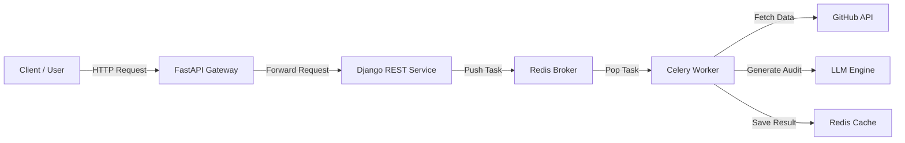

<a name="readme-top"></a>

<br />
<div align="center">
  <a href="https://github.com/yadavankush2404/codesentinel">
    
  </a>

  <h1 align="center">CodeSentinel</h1>

  <p align="center">
    <b>Commit with Confidence.</b>
    <br />
    A Distributed Microservices Architecture for Automated AI Code Reviews.
    <br />
    <br />
  </p>
</div>

<div align="center">
  
  
  
  
  
  
</div>

<br />

<details>
  <summary>Table of Contents</summary>
  <ol>
    <li><a href="#about-the-project">About The Project</a></li>
    <li><a href="#system-architecture">System Architecture</a></li>
    <li><a href="#tech-stack">Tech Stack</a></li>
    <li><a href="#getting-started">Getting Started</a></li>
  </ol>
</details>

---

## 🤖 About The Project

**CodeSentinel** is an automated code review assistant designed to enforce best programming practices in high-velocity engineering teams. 

Instead of waiting hours for a manual review, CodeSentinel fetches your Pull Request data, analyzes the diffs for errors and anti-patterns, and generates a structured JSON report using Generative AI. It is built on a robust **Microservices Architecture** ensuring scalability and fault tolerance.

**Key Capabilities:**
* 🚀 **Automated PR Analysis:** Fetches diffs directly from GitHub via PR number.
* 🧠 **AI-Powered Auditing:** Uses LLMs to detect bugs, security flaws, and style violations.
* ⚡ **Asynchronous Processing:** Heavy lifting is handled by Celery & Redis, keeping the API non-blocking.
* 🐳 **Fully Containerized:** One-command deployment using Docker Compose.

<p align="right">(<a href="#readme-top">back to top</a>)</p>

---

## 🏗 System Architecture

The system follows a distributed pattern where **FastAPI** acts as the Gateway and **Django** serves as the Core Logic Service.




## 🛠 Tech Stack

| Component | Technology | Role |
| :--- | :--- | :--- |
| **Gateway** | FastAPI | High-performance entry point for all traffic. |
| **Core Service** | Django REST Framework | Business logic, validation, and orchestration. |
| **Task Queue** | Celery | Distributed task execution for long-running AI jobs. |
| **Broker/Cache** | Redis | In-memory data structure store. |
| **AI Model** | [Your LLM Provider] | Generates code reviews and structured JSON. |
| **DevOps** | Docker & Docker Compose | Containerization and orchestration. |

<p align="right">(<a href="#readme-top">back to top</a>)</p>

---

## 🚀 Getting Started

Follow these steps to get a local copy up and running.

### Prerequisites

* Docker & Docker Compose
* GitHub Personal Access Token (for API rate limits)
* API Key for your LLM (here GROQ is the Provider)

### Installation

1.  **Clone the repo**
    ```sh
    git clone https://github.com/yadavankush2404/codesentinel.git
    cd codesentinel
    ```

2.  **Configure Environment Variables**
    Create a `.env` file in the root directory:
    ```env
    .env

    GITHUB_TOKEN=your_github_token

    GROQ_API_KEY = groq_llm_key

    REDIS_URL=redis://redis:6379/0
    ```

3.  **Build and Run with Docker**
    ```sh
    docker-compose up --build -d
    ```

4.  **Verify Services**
    * FastAPI Gateway: `http://localhost:8000/`
    * Django Service: `http://localhost:8001/`

<p align="right">(<a href="#readme-top">back to top</a>)</p>

## 📜 License
This project is open-source. Feel free to use it to protect your own data!

